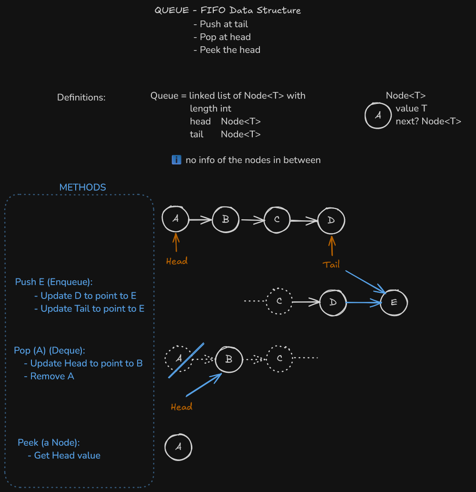

## Queue highlights



## Implementation

```golang
package main

type Node[T any] struct {
 value T
 next  *Node[T]
}

type Queue[T any] struct {
 head   *Node[T]
 tail   *Node[T]
 length int
}

// add one to the queue
func (q *Queue[T]) Enqueue(v T) {
  // ℹ️  we maintain ourself the queue length
  q.length++

  n := &Node[T]{value: v}
  // case empty queue
  if q.tail == nil {
    q.head = n
    q.tail = n
    return
  }

  // 🙋 be mindful of the order of the next lines
  // point current tail next node to the new node
  q.tail.next = n

  // make the tail the new node
  q.tail = n

}

// pop head
func (q *Queue[T]) Deque() *T {
 if q.head == nil {
  return nil
 }

 // ℹ️  we maintain ourself the queue length
 q.length--

 // backup current head to v
 v := q.head

 // update head to next node
 q.head = q.head.next

 // cleanup (not necessary with GC)
 v.next = nil

 return &v.value
}

func (q *Queue[T]) Peek() *T {
 if q.head == nil {
  return nil
 }
 return &q.head.value
}

```
