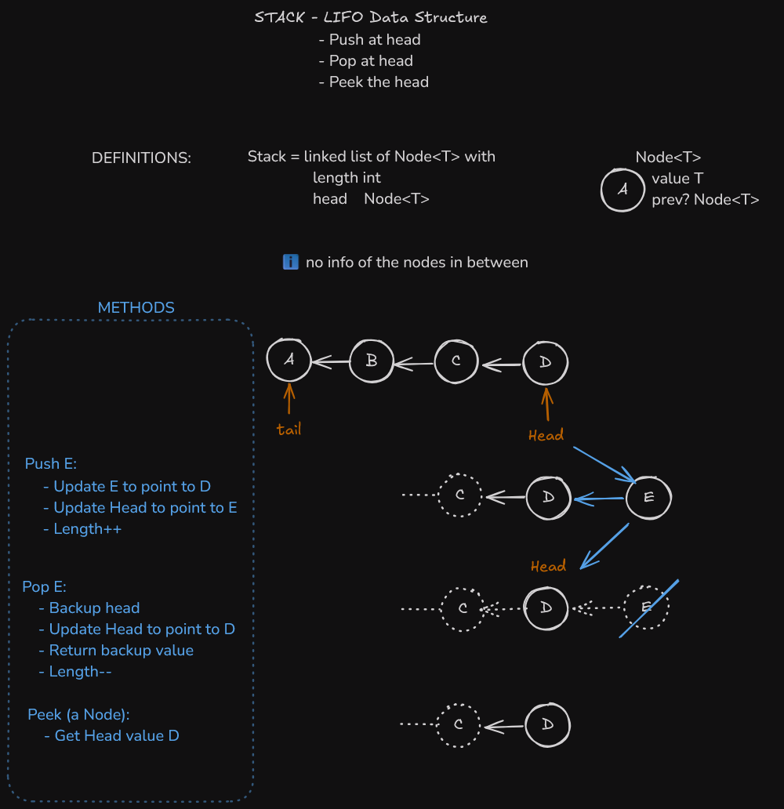

## Stack highlights



## Implementation

```py
class Node[T]:
    def __init__(self, value: T) -> None:
        self.value: T = value
        self.prev: Node[T] | None = None

    def __str__(self) -> str:
        return f"{self.value}, {self.prev}"


class Stack[T]:
    def __init__(self) -> None:
        self.head: Node[T] | None = None
        self.length: int = 0

    def push(self, T) -> None:
        n = Node(T)

        self.length += 1

        if self.head is not None:
            n.prev = self.head

        self.head = n

    def pop(self) -> T | None:
        if self.head is None:
            return None

        self.length -= 1

        n = self.head
        self.head = n.prev

        return n.value

    def peek(self) -> T | None:
        if not self.head:
            return None
        return self.head.value

    def isEmpty(self) -> bool:
        return not self.length

if __name__ == "__main__":
    print("testing for 🐛")
    q = Stack[int]()
    assert q.isEmpty() is True
    assert q.head is None

    q.push(1)
    assert q.peek() == 1
    assert q.length == 1
    assert q.isEmpty() is False

    q.push(2)
    assert q.head is not None
    assert q.head.value == 2

    q.push(3)
    assert q.head is not None
    assert q.head.value == 3

    print(f"q.head: {q.head}")

    v = q.pop()
    assert v == 3
    assert q.length == 2

    v = q.pop()
    assert v == 2
    assert q.length == 1

    v = q.pop()
    assert v == 1
    assert q.length == 0
    print("all good 😜")
```
